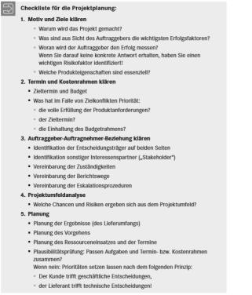
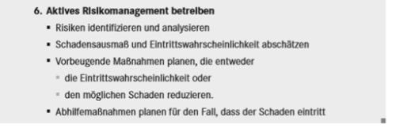
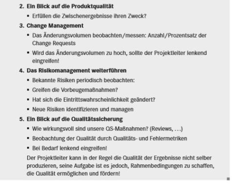
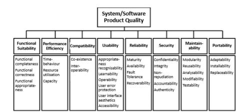

# Qualitätsmanagement
 #Qualitätsmanagement für IT-Projekte

Qualitätsmanagement lässt sich in zwei Teile innerhalb eines Projektes aufteilen zum einen 
das Qualitätsmanagement, welches festlegt wie gut die Projektergenisse werden sollen und die Qualität eines Produktes. Auf der anderen Seite steht dann die Qualitätssicherung, welche versucht das Risiko zu vermindern, wo die Projektergenisse nicht den Ansprüchen entsprechend sind, d.h. 
-	Die Qualitätssicherung schaut, ob die festgelegten Maßstäbe eingehalten werden, um eine angemessene Qualität zu erreichen.
-	Die Qualitätssicherung schaut, ob die festgelegten Maßstäbe überhaupt wirksam sind auf die Qualität des Projektes
-	Die Qualitätssicherung schaut auf das Produkt, welches in einem Projekt erzeugt wurde, gut genug ist
-	Die Qualitätssicherung informiert über die Qualität des Produktes und fordert gegebenenfalls angemessene Korrekturmaßnahmen
In kurz, Qualitätssicherung ist ein Teil des Qualitätsmanagements, welches die Risiken vermindert, die zu schlechten Ergebnissen führen können. 
Das Qualitätsmanagement in einem Projekt hingegen definiert den Stellenwert der Produktqualität innerhalb eines Projektes. Zudem werden kritische Anforderungen identifiziert, welche das Projekt im Ganzen und seine Ergebnisse betreffen. Auch die Qualitätsanforderungen werden durch das Qualitätsmanagement definiert. Dazu kommen die organisatorischen Voraussetzungen, um die angezielte Qualität zu produzieren. Dazu kommt, dass das Qualitätsmanagement dafür sorgt, dass die Qualität trotz Termin- und Kostendruck nicht zu kurz kommt, all diese Informationen lassen sich durch das sogenannte Teufelsquadrat darstellen.   
  

Die Qualität, in der ein Produkt erzeugt wird hängt von den vordefinierten Anforderungen ab, die das Qualitätsmanagement, dabei stellt man sich die Fragen, wie viel Qualität ist angemessen und wann ist das Produkt „gut genug“. Um diese Fragen zu beantworten muss man sich Erfordernisse angucken.  Folgende Abhängigkeiten können auftreten :
-	Das Kundenbedürfnis und den daraus abgeleiteten Anforderungen
-	Den regulatorischen Vorgaben, wie z.b. gesetzliche Regelungen
-	Den Sicherheitsrisiken, die mit Qualitätsmängeln verbunden sind
-	Den wirtschaftlichen Risiken, die mit Qualitätsmängeln verbunden sind

In kurz kann gesagt werden, dass die Qualitätsanforderung zwei Aspekten unterliegt zum einen der Aspekt der erwarteten oder geforderten Leistungen und der Aspekt der Risikovorsorge.  Diese Aspekte wachsen in Bedeutung um so größer der mögliche Schaden ist, welcher durch Mängel an einem Produkt ausgelöst werden können. Um dieser sogenannten Qualität was handfest zu Grunde zu legen, kann man sie durch
1.	Brauchbarkeit
2.	Wartbarkeit
definieren. Wobei die Brauchbarkeit die Qualität eines Produktes aus der Sicht des Benutzers beschreibt und einer der entscheiden Faktoren ist für die Akzeptanz eines Produktes. Die Wartbarkeit die Qualität eines Produktes aus der Sicht der Entwickler beschreibt und die Lebensdauer eines Produktes auf dem Markt definiert, dass heißt falls das Einsatzgebiet für ein Produkt geändert wird, dass nötige Funktionen schnell angepasst werden können. 
Ob dann das Produkt „gut genug“ ist wird, abhängig von der vordefinierten Regel durch Kent Benk definiert: „Geschäftsleute treffen Geschäftsentscheidungen.  Techniker treffen technische Entscheidungen.“
Aber um zu diesen Punkt zu gelangen muss die Qualitätssicherung für das Projektmanagement festgelegt werden, d.h. 
-	Qualitätssicherung im Rahmen der Projektplannung
-	Qualitätssicherung im Rahmen der Projektsteuerung
-	Qualitätssicherung im Rahmen des Risikomanagements
-	Qualitätssicherung für das Configuration Managements
Configuration Management ist zwar kein Thema, das direkt zum Projektmanagement gehört, hat aber aufgrund seiner Funktion in der Dokumentenlenkung eine gewisse Nähe zur Projektplanung und Projektsteuerung und ist eines der Schlüsselthemen für eine qualitätsgesicherte Entwicklung. 

 

Qualitätssicherung im Rahmen der Projektsteuerung :
  

Qualitätssicherung im Rahmen des Risikomanagements: 
Aus der Sicht der Qualitätssicherung ergeben sich folgenden Fragen hinsichtlich des Risikomanagements, von wem wird das Risikomanagement innerhalb eines Projektes betrieben. Auf welche Risiken werden geachtet und welche Maßnahmen werden umgesetzt, um diese Risiken zu vermindern. 

Im kommenden Abschnitt wird noch auf ein paar Themen eingegangen, welche auch eine große Rolle für die QS oder das QM haben. 
Die erste ist ISO 25010, bei der Definition von Qualiätsanforderungen an Softwareprodukte unterstützt uns die ISO-25000-Serie mit zwei Qualitätsmodellen für
-	Quality in Use
-	Product Quality
Die Quality in Use beschreibt die Qualität aus der Sicht des Anwenders in seinem jeweiligen Anwendungskontext. Diese ist geprägt durch den jeweiligen Einsatzzweck, sowie durch die System­ und Arbeitsumgebung. Die Merkmale der Quality in Use entscheiden damit über die Brauchbarkeit einer SW­Lösung in einem bestimmten Einsatzszenario. Sie ist Gegenstand der Validierung.
 Die Produktqualität beschreibt die Qualitätsmerkmale aus einer vom konkreten Anwendungskontext losgelösten Sicht, z. B. aus der Sicht des Produktanbieters oder einer Produktspezifikation. Die Unterscheidung zwischen „Product Quality“ und „Quality in Use“ kommt immer dann zum Tragen, wenn eine (Standard­)Lösung in verschiedenen Anwendungskontexten zum Einsatz kommt. Die „Quality in Use“ kann für ein und dasselbe Produkt für verschiedene Einsatzszenarien oder Anwender sehr unterschiedlich sein.

Um die Quality in Use nochmal zu verdeutlichen 

Das selbe hier nochmal für die Produktqualität :

Dann gibt es noch sogenannte Quality Gates (ISO 15504-6), welche eigentlich nur spezielle Meilensteine sind in einem Projektablauf, die vorher definierte Erfüllungskriterien haben, wo dann entscheiden wird ob das Projekt nach Plan fortgesetzt wird, ob Maßnahmen vereinbart werden, welche die Sicherung der Projektziele betreffen oder der komplette Abbruch des Projektes. 
Typische Quality Gates im Software- oder System Life cycle sind Konzept -> Anforderungsanalyse -> Entwicklung des Produktes -> Erprobung -> Freigabe für den Regelbetrieb -> Außer-Dienst-Stellung. 

Zusammenfassung: 

